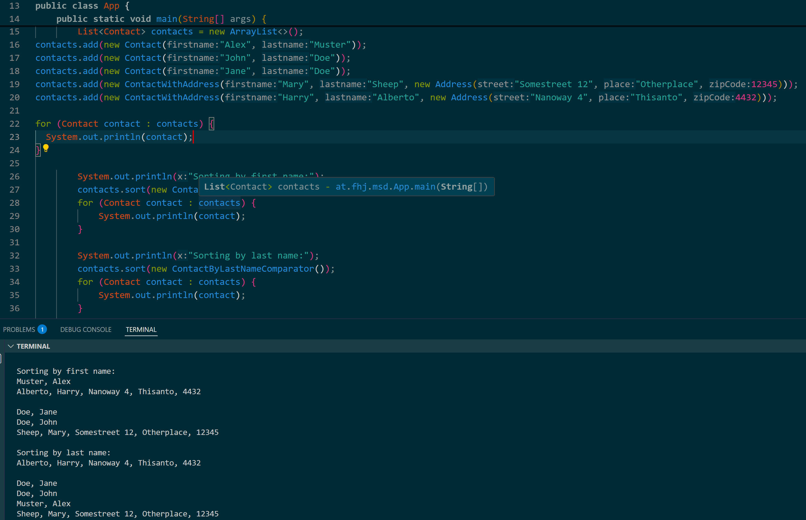
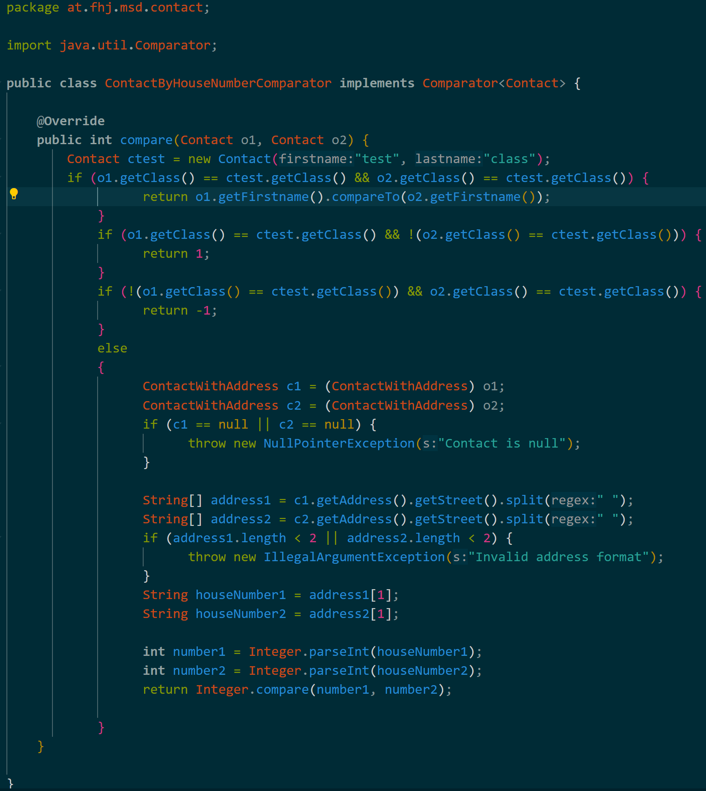

# sort by

## Reflection Questions 1

- What do you need to adapt or add to the `Contact' class so that you can compare two objects?  
A: A getter Method or make the Variables (firstname, lastname) public.

- Does it make a difference whether a Contact or a ContactWithAddress is passed to the comparator for this use case? 
A: No, it still is able to sort it correctly  
  

- When you check out the example solution, how could you extend both comparators so that they optionally ignore the case when comparing?  
A: I added an additional method that takes a boolean and depending of the Value of the boolean, it ignores Case, or you can just use compareToIgnoreCase in the original compare Method

## Reflection Questions 2

- What should be the generic parameter if you want to compare any contact with this comparator?  
A: Object or Contact

- What would an additional comparator look like that sorts the contacts by the house number that is part of the street?  
A: He would need to Split the String Street and take the second attribute and compare on that.

- Why would Comparator\<Address> be wrong for this use case?  
A: Address has no conection to Contact, It just serves as a Info Attriubte
